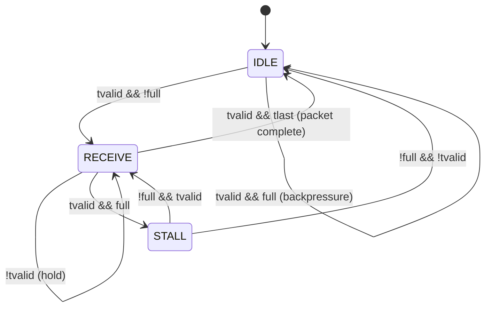
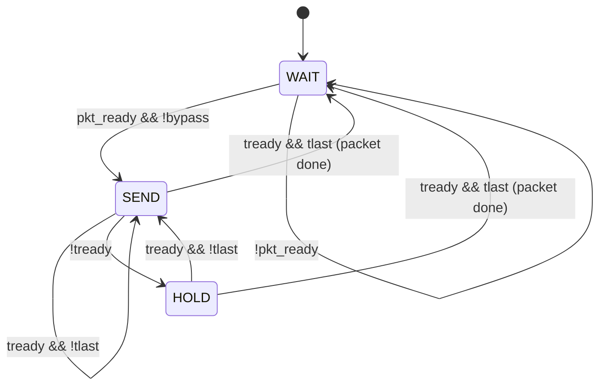
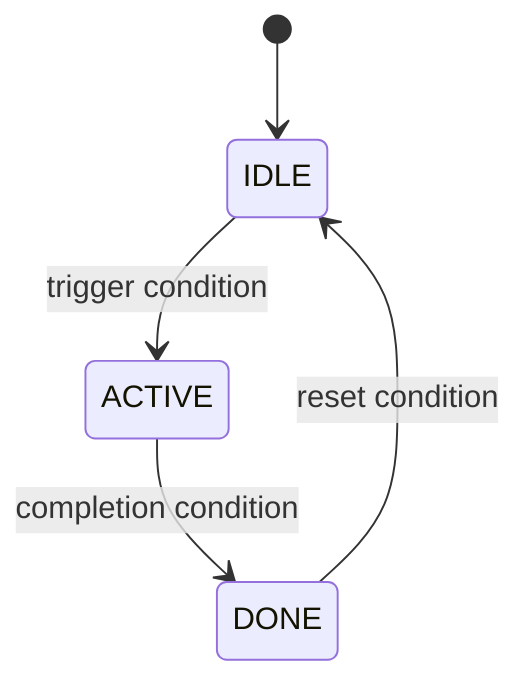

# RTL Design Document Template

This file serves dual purpose: (1) a blank template with annotations explaining what to fill in, and (2) a complete example showing a filled-in design document for an AXI Packet Buffer module.

## Table of Contents

- [Part 1: Annotated Template](#part-1-annotated-template)
- [Part 2: Example Design Document -- AXI Packet Buffer](#part-2-example-design-document----axi-packet-buffer)
- [Part 3: Standard Formats Reference](#part-3-standard-formats-reference)
- [Interface Table Format](#interface-table-format)
- [Parameter Table Format](#parameter-table-format)
- [FSM State Enumeration Format](#fsm-state-enumeration-format)
- [FSM State Diagram Format](#fsm-state-diagram-format)
- [Pipeline Stage Table Format](#pipeline-stage-table-format)
- [Timing Description Format](#timing-description-format)
- [Sub-module Specification Table Format](#sub-module-specification-table-format)
- [DFX Plan Table Format](#dfx-plan-table-format)

---

## Part 1: Annotated Template

Use this structure for every design document. Fill in every section. If a section does not apply, state "Not applicable because [reason]" rather than omitting it.
Describe the design as hardware, not software: use registers, combinational logic, handshakes, FSMs, and clocked behavior. Do not use software pseudocode.

```markdown
# Design Document: [Module Name]

## 1. Requirements Summary

### 1.1 Functional Requirements
<!-- List every functional requirement extracted from the spec.
     For each: what the module does, interface protocol, data format,
     throughput, latency, and operating modes. -->

### 1.2 Non-Functional Constraints
<!-- Clock frequency target, area budget (LUT/FF or gate count),
     power budget, timing margin requirement. These directly
     constrain pipeline depth and resource usage. -->

### 1.3 Invariants
<!-- Constraints that must hold under all conditions.
     These become assertions during implementation. -->

### 1.4 Non-Goals
<!-- What is explicitly out of scope. Prevents scope creep. -->

### 1.5 Open Questions and Pending Confirmations
<!-- List architecture-driving unknowns, assumptions that still require
     confirmation, and implementation-sensitive items that must be
     revisited later. Keep this explicit rather than burying it in prose. -->

## 2. Sub-module Specification

### 2.1 Sub-module List
<!-- Table: Name | Type | Function | Interface Summary | Performance | Dependencies
     Type is one of: Datapath, Control, Storage, Interface
     Every sub-module identified during partitioning must appear here. -->

### 2.2 Sub-module Interface Details
<!-- For each sub-module, a port table following the Interface Table Format
     (see Part 3). Include all inter-module signals with direction, width,
     and clock domain. -->

## 3. Microarchitecture

### 3.1 Module Block Diagram
<!-- ASCII art or Mermaid diagram showing module hierarchy and signal flow.
     Top-level ports and major inter-module interfaces must appear in both
     the diagram and the interface table. Minor internal signals may be
     omitted if drawing them would harm readability. -->

### 3.2 Interface Definition
<!-- Port table: Port | Direction | Width | Clock Domain | Description
     Include every top-level port. -->

### 3.3 Parameter Definition
<!-- Parameter table: Parameter | Default | Range | Description
     Every parameter must have a defined valid range. -->

### 3.4 FSM Definition
<!-- For each FSM in the design:
     1. State enumeration table: State | Role
     2. State diagram (Mermaid stateDiagram-v2 preferred for complex FSMs,
        ASCII acceptable for simple ones)
     3. Main path description: text describing the primary control flow
     4. Edge cases: list boundary conditions the FSM must handle
     Do NOT include binary encoding or detailed signal assignments —
     those are implementation details deferred to rtl-impl. -->

### 3.5 Timing Description
<!-- Cycle-by-cycle behavior for primary operations.
     Shows when data enters, is processed, and exits.
     For pipelined datapaths, begin with a stage table:
     Stage | Register Boundary | Logic Performed | Output Availability
     so that each pipeline stage has explicit responsibility. -->

### 3.6 Clock Domain Partitioning
<!-- List every clock domain and every CDC crossing.
     For each crossing: method, width, expected latency. -->

### 3.7 Reset Strategy
<!-- Reset type, domains, and defined reset state for every output. -->

### 3.8 PPA Techniques
<!-- Document every design-level PPA technique applied:
     - What constraint drives it (power budget, area budget, timing)
     - What technique is used (clock gating, resource sharing, etc.)
     - What is traded off (latency for area, area for power, etc.)
     If no PPA techniques beyond basic pipeline decisions, write
     "Not applicable — no specific PPA techniques beyond §3.5 pipeline structure." -->

### 3.9 Backend Awareness
<!-- ASIC target considerations:
     - Critical path estimates: which paths are likely timing bottlenecks
     - Timing hot spots and preferred cut points or mitigations
     - Fanout concerns: any high-fanout signals needing hierarchical handling
     - Hard macro integration: any fixed IP with interface/placement constraints
     - Physical partitioning: alignment of module boundaries with physical regions
     FPGA prototype adaptation:
     - Resource mapping: ASIC→FPGA primitive mapping plan
     - Frequency derating: modules that need lower clock on FPGA, with reason
     - ASIC-only construct bypass: any constructs needing FPGA substitutes
     If single-domain simple design with no special backend concerns,
     state "No special backend considerations." -->

### 3.10 DFX Plan
<!-- Table: DFX Feature | Source (necessity/weakness) | Design Concern | Exposure Method
     Every DFX feature must trace to a specific design concern.
     Source is "necessity" (inherent to this type of module) or
     "weakness" (driven by a risk from §6).
     Exposure method: status register bit, output port, counter, interrupt, etc. -->

## 4. Implementation Notes
<!-- This section is deferred to the implementation phase (rtl-impl).
     Write "Deferred to implementation phase — CBB selection, instantiation
     details, and coding decisions will be documented here by rtl-impl."
     unless the user requests this section to be filled during design. -->

## 5. Design Constraints and Trade-offs
<!-- State every non-obvious decision with rationale.
     PPA trade-offs must include the numbers behind the decision. -->

## 6. Risk Assessment
<!-- Table: Risk | Likelihood | Impact | Fallback | DFX
     Every design carries risk. State it explicitly.
     DFX column: corresponding DFX feature from §3.10, or "--" if none. -->
```

---

## Part 2: Example Design Document -- AXI Packet Buffer

# Design Document: AXI Packet Buffer (axi_packet_buffer)

## 1. Requirements Summary

### 1.1 Functional Requirements

- Accept variable-length packets via AXI4-Stream slave interface (s_axis)
- Buffer up to `DEPTH` words of `DATA_WIDTH` bits each
- Process buffered data through a configurable threshold check on each word
- Transmit processed packets via AXI4-Stream master interface (m_axis)
- Support backpressure on both input and output sides independently
- Indicate almost-full status when buffer occupancy reaches `FULL_THRESHOLD`
- Packet length is indicated by `tlast` signal on the AXI4-Stream interface
- Throughput: 1 word per clock cycle sustained when backpressure is absent
- Latency: 2 clock cycles from s_axis input acceptance to m_axis output availability in bypass mode

### 1.2 Non-Functional Constraints

- Clock frequency: 250 MHz target in 28nm ASIC library (4 ns period)
- Area budget: under 5000 gate equivalents for default configuration (DATA_WIDTH=32, DEPTH=16)
- Power: no specific budget, but minimize toggle activity on idle paths
- Timing margin: target 20% slack (800 ps margin on critical path)

### 1.3 Invariants

- No packet data is ever lost: backpressure is always honored
- Packet integrity is preserved: words of a single packet are never interleaved with words from another packet
- Output data order matches input data order (no reordering)
- After reset, all outputs are driven to known idle state: tvalid=0, tdata=0, tlast=0, almost_full=0

### 1.4 Non-Goals

- This module does not perform error correction or detection on packet data
- This module does not support packet segmentation or reassembly
- This module does not implement clock domain crossing (single clock domain only)

### 1.5 Open Questions and Pending Confirmations

- No open questions for the baseline single-clock configuration.
- If `DEPTH > 64`, confirm during implementation whether SRAM macro substitution is preferred over register-based storage.

## 2. Sub-module Specification

### 2.1 Sub-module List

| Name | Type | Function | Interface Summary | Performance | Dependencies |
|------|------|----------|-------------------|-------------|--------------|
| rx_buffer | Storage | Buffer incoming packet words with FWFT output, track occupancy | AXI4-Stream slave input, FIFO read interface output, almost-full flag | 1 write/cycle sustained, programmable threshold | Driven by rx_fsm, read by tx_fsm |
| threshold_cmp | Datapath | Compare buffered data word against configurable threshold | Data input, threshold value input, above_threshold output | Combinational, <1 cycle | Reads from rx_buffer output |
| out_mux | Datapath | Select between bypass path and buffered path to output | Two data inputs, select control, one data output | Combinational, <1 cycle | Select from bypass_sel, data from rx_buffer or s_axis passthrough |
| rx_fsm | Control | Control packet receive flow: accept words, handle backpressure, detect packet boundaries | Internal control signals to rx_buffer and status outputs | 1 decision/cycle | Monitors s_axis, rx_buffer status |
| tx_fsm | Control | Control packet transmit flow: read from buffer, send to m_axis, handle backpressure | Internal control signals to rx_buffer read port and m_axis outputs | 1 decision/cycle | Monitors rx_buffer data, m_axis ready |

### 2.2 Sub-module Interface Details

#### rx_buffer

| Port | Direction | Width | Clock Domain | Description |
|------|-----------|-------|-------------|-------------|
| wr_en | input | 1 | clk | Write enable from rx_fsm |
| wr_data | input | DATA_WIDTH | clk | Data from s_axis_tdata |
| rd_en | input | 1 | clk | Read enable from tx_fsm |
| rd_data | output | DATA_WIDTH | clk | FWFT output data |
| rd_tlast | output | 1 | clk | FWFT output tlast |
| full | output | 1 | clk | Buffer is full |
| almost_full | output | 1 | clk | Occupancy >= FULL_THRESHOLD |
| pkt_ready | output | 1 | clk | Complete packet available for read |
| pkt_end | input | 1 | clk | Pulse: last word of packet written |

#### rx_fsm

| Port | Direction | Width | Clock Domain | Description |
|------|-----------|-------|-------------|-------------|
| s_axis_tvalid | input | 1 | clk | From top-level |
| s_axis_tlast | input | 1 | clk | From top-level |
| fifo_full | input | 1 | clk | From rx_buffer |
| s_axis_tready | output | 1 | clk | To top-level |
| fifo_wr_en | output | 1 | clk | To rx_buffer |
| pkt_end | output | 1 | clk | To rx_buffer |

#### tx_fsm

| Port | Direction | Width | Clock Domain | Description |
|------|-----------|-------|-------------|-------------|
| pkt_ready | input | 1 | clk | From rx_buffer |
| fifo_tlast | input | 1 | clk | From rx_buffer |
| m_axis_tready | input | 1 | clk | From top-level |
| bypass_sel | input | 1 | clk | From top-level |
| fifo_rd_en | output | 1 | clk | To rx_buffer |
| m_axis_tvalid | output | 1 | clk | To top-level |

## 3. Microarchitecture

### 3.1 Module Block Diagram

```
                    +--------------------------------------------------+
                    |              axi_packet_buffer                   |
                    |                                                  |
  s_axis_tdata  --->+-> [rx_buffer] -----------------+--> [out_mux] -+---> m_axis_tdata
  s_axis_tvalid --->+    (FWFT mode)                 |    (bypass/   |---> m_axis_tvalid
  s_axis_tready <---+     |    |                     |     fifo)     |---> m_axis_tlast
                    |     |    |                     |               |
                    |  [rx_fsm]  |--> [threshold_cmp] |               |
                    |     ^      |       |            |               |
                    |     |      |       v            |               |
                    |     |      |   almost_full_o ---> (output)      |
                    |     |      |                                  |
                    |  [tx_fsm] <-+                                  |
                    |     ^                                          |
                    |     |                                          |
  bypass_sel   ---->+-----+---> (out_mux select)                     |
  clk          ---->+---> (all registers)                             |
  rst_n        ---->+---> (all registers)                             |
                    |                                                  |
                    +--------------------------------------------------+
```

### 3.2 Interface Definition

| Port | Direction | Width | Clock Domain | Description |
|------|-----------|-------|-------------|-------------|
| clk | input | 1 | -- | System clock, 250 MHz |
| rst_n | input | 1 | -- | Active-low synchronous reset |
| s_axis_tdata | input | DATA_WIDTH | clk | AXI4-Stream slave data input |
| s_axis_tvalid | input | 1 | clk | AXI4-Stream slave valid |
| s_axis_tready | output | 1 | clk | AXI4-Stream slave ready |
| s_axis_tlast | input | 1 | clk | AXI4-Stream slave last word of packet |
| m_axis_tdata | output | DATA_WIDTH | clk | AXI4-Stream master data output |
| m_axis_tvalid | output | 1 | clk | AXI4-Stream master valid |
| m_axis_tready | input | 1 | clk | AXI4-Stream master ready |
| m_axis_tlast | output | 1 | clk | AXI4-Stream master last word of packet |
| bypass_sel | input | 1 | clk | 1=bypass mode (input directly to output), 0=buffered mode |
| almost_full_o | output | 1 | clk | Buffer occupancy reached FULL_THRESHOLD |

### 3.3 Parameter Definition

| Parameter | Default | Range | Description |
|-----------|---------|-------|-------------|
| DATA_WIDTH | 32 | [8, 16, 32, 64, 128] | Width of data bus in bits. Must be a power-of-2 multiple of 8. |
| DEPTH | 16 | [2, 4, 8, 16, 32, 64, 128, 256] | FIFO buffer depth. Must be a power of 2. |
| FULL_THRESHOLD | 14 | [1, DEPTH-1] | Occupancy level at which almost_full_o asserts. Must be less than DEPTH. |

### 3.4 FSM Definition

#### Receive FSM (rx_fsm)

**State Enumeration:**

| State | Role |
|-------|------|
| IDLE | Waiting for incoming packet. Ready to accept first word. |
| RECEIVE | Actively receiving packet words into buffer. |
| STALL | Buffer full while packet is in progress — backpressure applied to upstream. |

**State Diagram:**



**Main Path:** IDLE → RECEIVE (on first valid word) → RECEIVE (loop for each word) → IDLE (on tlast). The FSM accepts one word per cycle when buffer is not full.

**Edge Cases:**
- Packet arrives when buffer is full: FSM enters STALL, deasserts tready to apply backpressure
- STALL while source deasserts tvalid: return to IDLE (partial packet remains in buffer)
- Back-to-back packets: IDLE → RECEIVE → IDLE → RECEIVE without gap

#### Transmit FSM (tx_fsm)

**State Enumeration:**

| State | Role |
|-------|------|
| WAIT | No complete packet in buffer. m_axis_tvalid deasserted. |
| SEND | Transmitting packet words from buffer to m_axis. |
| HOLD | Data valid but consumer not ready — holding output. |

**State Diagram:**



**Main Path:** WAIT → SEND (when packet complete in buffer) → SEND (loop for each word) → WAIT (on last word with tready). The FSM outputs one word per cycle when consumer accepts.

**Edge Cases:**
- Consumer asserts backpressure mid-packet: FSM enters HOLD, keeps tvalid asserted, holds current data
- Packet complete while in HOLD: transitions to WAIT on next tready
- Bypass mode: tx_fsm inactive, data passes through out_mux combinationally

### 3.5 Timing Description

| Stage | Register Boundary | Logic Performed | Output Availability |
|-------|-------------------|-----------------|---------------------|
| S0: Input Accept | AXI4-Stream slave input handshake | rx_fsm accepts `s_axis_*`, writes into `rx_buffer` | Same cycle as valid/ready handshake |
| S1: Buffer / Compare | `rx_buffer` FWFT output boundary | Buffered data becomes visible; `threshold_cmp` evaluates current word | 1 cycle after initial write for sustained stream |
| S2: Output Select | `out_mux` to `m_axis_*` output boundary | Select bypass or buffered data and present to output interface | 2 cycles from first accepted input word in buffered mode |

#### Packet Receive Flow (normal operation, no backpressure)

```
Cycle 0: s_axis_tvalid=1, s_axis_tdata=word0, s_axis_tlast=0
         -> rx_fsm: IDLE -> RECEIVE, accept data

Cycle 1: s_axis_tvalid=1, s_axis_tdata=word1, s_axis_tlast=0
         -> rx_fsm: RECEIVE, word0 available on FWFT output

Cycle 2: s_axis_tvalid=1, s_axis_tdata=word2, s_axis_tlast=0
         -> rx_fsm: RECEIVE, word1 on FWFT output

Cycle N: s_axis_tvalid=1, s_axis_tdata=wordN, s_axis_tlast=1
         -> rx_fsm: RECEIVE -> IDLE, packet complete

Cycle N+1: Packet complete in buffer, tx_fsm: WAIT -> SEND
           m_axis_tvalid=1, m_axis_tdata=word0, m_axis_tlast=0
```

#### Bypass Mode Timing

```
Cycle 0: s_axis_tvalid=1, s_axis_tdata=word0, bypass_sel=1
         -> m_axis_tdata=word0 (combinational path through out_mux)
         -> m_axis_tvalid=1, s_axis_tready=m_axis_tready (pass-through)

Cycle 1: Consumer asserts m_axis_tready=1
         -> Transfer complete, next word accepted
```

### 3.6 Clock Domain Partitioning

Single clock domain (clk). No CDC crossings in this module.

### 3.7 Reset Strategy

- **Reset type**: Active-low synchronous reset (rst_n). All registers reset on the rising edge of clk when rst_n is low.
- **Reset domains**: Single reset domain. Entire module shares rst_n.
- **Reset state**:
  - rx_fsm: IDLE
  - tx_fsm: WAIT
  - s_axis_tready: 1 (ready to accept data immediately after reset)
  - m_axis_tvalid: 0
  - m_axis_tdata: 0
  - m_axis_tlast: 0
  - almost_full_o: 0

### 3.8 PPA Techniques

- **Clock gating on idle paths**: The power constraint calls for minimizing toggle activity on idle paths. Apply module-level clock gating to the tx_fsm and buffer read path when no packet is available (pkt_ready == 0). This prevents the read-side pipeline from toggling during idle periods. Tradeoff: clock gating cell adds ~2 gate equivalents per gated domain; negligible for this module size.

- **Operand isolation on threshold comparator**: The threshold comparator (threshold_cmp) only needs to be active when the buffer has valid data. Isolate its inputs during idle to reduce dynamic power. Tradeoff: one mux per comparator input, area impact negligible.

No resource sharing or time-division multiplexing is needed — the module is single-channel and throughput requires 1 word/cycle dedicated processing.

### 3.9 Backend Awareness

**ASIC target (28nm):**
- **Critical path estimate**: The FWFT buffer read-to-out_mux-to-m_axis path is the likely critical path. The buffer FWFT output feeds through the 2:1 out_mux combinationally, and the mux output drives the m_axis output registers. At 250 MHz (4 ns period), this path should meet timing with margin, but it should be monitored during synthesis.
- **Preferred cut point / mitigation**: If synthesis shows margin loss on the FWFT buffer read-to-out_mux path, insert a register between `rx_buffer` output and `out_mux` input. This changes buffered-mode latency from 2 cycles to 3 cycles but preserves throughput after pipeline fill.
- **Fanout**: No high-fanout concerns in this design. The almost_full_o signal drives one external consumer. Internal control signals (fifo_wr_en, fifo_rd_en) each drive one module.
- **Hard macros**: No hard IP integration in this module. The buffer will be implemented using standard cell register files at this depth (DEPTH ≤ 256). For configurations with DEPTH > 64, consider SRAM macro substitution during implementation.
- **Physical partitioning**: No special physical constraints. The module is small enough to fit in a single physical block.

**FPGA prototype adaptation:**
- **Resource mapping**: Buffer → BRAM-based FIFO (FWFT mode supported by Xilinx BRAM FIFO primitives). Comparator and mux → LUT fabric. No DSP usage needed.
- **Frequency derating**: FPGA prototype target 125 MHz (ASIC target 250 MHz). BRAM access timing limits FPGA frequency. Throughput halved in prototype — acceptable for functional verification.
- **ASIC-only constructs**: None in this design. No latches, no analog, no custom I/O.

### 3.10 DFX Plan

| DFX Feature | Source | Design Concern | Exposure Method |
|-------------|--------|----------------|-----------------|
| Buffer occupancy counter | Necessity | Design contains FIFO — occupancy visibility required for debug | Status register: occupancy[log2(DEPTH):0] |
| FSM state debug output (rx_fsm, tx_fsm) | Necessity | Design contains FSMs — state must be observable for verification | Debug output ports: rx_fsm_state[1:0], tx_fsm_state[1:0] |
| Overflow/underflow flags | Weakness | Risk: buffer overflow during STALL condition | Status register bits: overflow_sticky, underflow_sticky |
| Packet counter (received / transmitted) | Necessity | Datapath design — throughput validation requires packet counts | Counters: rx_pkt_cnt[31:0], tx_pkt_cnt[31:0] |
| Stall cycle counter | Weakness | Risk: backpressure latency exceeds 2 cycles — need to measure actual stall duration | Counter: rx_stall_cycles[31:0], tx_stall_cycles[31:0] |
| FWFT buffer health check for DEPTH=2 | Weakness | Risk: FWFT buffer corner case at DEPTH=2 — need observable indicator during verification | Status register bit: fwft_data_valid (should assert 1 cycle after write) |

Every DFX feature traces to either a module characteristic (necessity) or a specific risk item from §6 (weakness).

## 4. Implementation Notes

Deferred to implementation phase — CBB selection, instantiation details, and coding decisions will be documented here by rtl-impl.

## 5. Design Constraints and Trade-offs

- **FWFT buffer chosen over standard buffer**: First-Word Fall-Through eliminates 1 cycle of read latency. The data appears on the buffer output in the same cycle it is written, which is required to meet the 2-cycle bypass latency specification. Tradeoff: FWFT buffers use slightly more area (output register bypass logic) than standard ones.

- **Depth 16 with FULL_THRESHOLD=14**: The upstream source is expected to issue bursts of up to 8 words. With a 2-word safety margin for pipeline latency between almost-full assertion and upstream stall response, FULL_THRESHOLD=14 provides 2 words of headroom after the threshold is crossed. Depth 16 accommodates the burst plus the margin.

- **Separate rx_fsm and tx_fsm rather than a single FSM**: Dual FSM allows concurrent receive and transmit, achieving full-duplex throughput (1 word/cycle in, 1 word/cycle out simultaneously). A single FSM would serialize these operations and halve throughput.

- **Bypass mode uses combinational mux path**: When bypass_sel=1, data flows from s_axis_tdata through the 2:1 mux to m_axis_tdata combinationally. This saves buffer read/write latency but adds combinational path delay. At 250 MHz (4 ns period) with the target 28nm library, the mux path delay is negligible (< 100 ps).

## 6. Risk Assessment

| Risk | Likelihood | Impact | Fallback | DFX |
|------|-----------|--------|----------|-----|
| Buffer critical path exceeds 800 ps margin at 250 MHz | Low | High | Add pipeline register on buffer output, accept 1 extra cycle latency | FWFT buffer health check (fwft_data_valid flag) |
| Area exceeds 5000 gate estimate for DATA_WIDTH=128 | Medium | Medium | For wide configurations, accept higher area. Document scaling factor. | -- |
| Backpressure latency from almost_full_o to s_axis_tready exceeds 2 cycles | Low | High | Add pipeline register on almost_full path, increase FULL_THRESHOLD | Stall cycle counters (rx/tx) |
| FWFT buffer does not handle DEPTH=2 corner case | Medium | Medium | Verify with directed test. If broken, use standard buffer with wrapper. | FWFT buffer health check + overflow sticky flag |

---

## Part 3: Standard Formats Reference

### Interface Table Format

```markdown
| Port | Direction | Width | Clock Domain | Description |
|------|-----------|-------|-------------|-------------|
| name | input/output | N or [M:0] | clk_name | Functional description |
```

Rules:
- Direction is always from the perspective of this module (input = comes from outside, output = goes to outside).
- Width is specified as an integer for single-bit signals or `[M:0]` notation for buses. Parameterized widths use the parameter name.
- Clock domain identifies which clock edge the signal is synchronous to. Use "--" for asynchronous signals.
- Every clock and reset port must be listed.

### Parameter Table Format

```markdown
| Parameter | Default | Range | Description |
|-----------|---------|-------|-------------|
| NAME | value | [min, max] or enumeration | What it controls and valid values |
```

Rules:
- Range must be explicit. Use `[min, max]` for continuous ranges or `{val1, val2, val3}` for discrete values.
- State whether power-of-2 restriction applies.
- Note any inter-parameter dependencies (e.g., "FULL_THRESHOLD must be less than DEPTH").

### FSM State Enumeration Format

```markdown
| State | Role |
|-------|------|
| NAME | What this state does and why it exists |
```

Rules:
- Use descriptive names that convey the state's purpose (e.g., RECEIVE, not S1).
- Role should explain what the module is doing in this state, not just repeat the name.

### FSM State Diagram Format

Use Mermaid `stateDiagram-v2` for complex FSMs:



For simple FSMs (2-3 states), ASCII is acceptable:

```
IDLE --(tvalid)--> RECEIVE --(tlast)--> IDLE
```

Rules:
- Mark the reset/initial state with `[*] -->` in Mermaid or note it explicitly in ASCII.
- Label every transition with the triggering condition.
- All states must be reachable from the initial state.
- All states must have at least one exit transition (no dead states unless the state is a terminal error state).

### Pipeline Stage Table Format

Use this table before the cycle-by-cycle timing description when the datapath is pipelined:

```markdown
| Stage | Register Boundary | Logic Performed | Output Availability |
|-------|-------------------|-----------------|---------------------|
| S0 | input register / handshake boundary | what combinational work happens here | when this stage's output becomes valid |
```

Rules:
- Include one row per architectural pipeline stage.
- Name the stage by function or index.
- Register Boundary should identify where data is captured or becomes stable.
- Logic Performed should describe hardware work, not software steps.
- Output Availability should state relative cycle latency from input acceptance.

### Timing Description Format

For pipelined datapaths, emit the pipeline stage table first, then the cycle-by-cycle timing.

```markdown
Cycle N: [input stimulus]
         -> [FSM transition], [internal behavior]
Cycle N+1: [resulting output]
```

Rules:
- Number cycles starting from 0 (first active clock edge).
- Show both input stimulus and resulting behavior.
- Cover the primary operation from start to finish.
- Separate timing descriptions for different operating modes if they differ significantly.

### Sub-module Specification Table Format

```markdown
| Name | Type | Function | Interface Summary | Performance | Dependencies |
|------|------|----------|-------------------|-------------|--------------|
| module_name | Datapath/Control/Storage/Interface | What it does | Port summary | Throughput/latency | Connected modules |
```

Rules:
- Every sub-module from the design partitioning must appear.
- Type determines architectural role (storage modules hold state, control modules coordinate sequencing, datapath modules transform data, interface modules adapt protocol or clocking boundaries).
- Dependencies column identifies which other sub-modules this one directly connects to.

### DFX Plan Table Format

```markdown
| DFX Feature | Source | Design Concern | Exposure Method |
|-------------|--------|----------------|-----------------|
| feature name | necessity / weakness | what design characteristic or risk drives this | status register bit, output port, counter, interrupt |
```

Rules:
- Source must be "necessity" (inherent to the module type) or "weakness" (driven by a risk from §6).
- Every weakness-driven DFX feature must reference a specific risk item.
- Every DFX feature must have a concrete exposure method — "added for debug" is not specific enough.
- Do not add DFX features without a traceable design concern.
